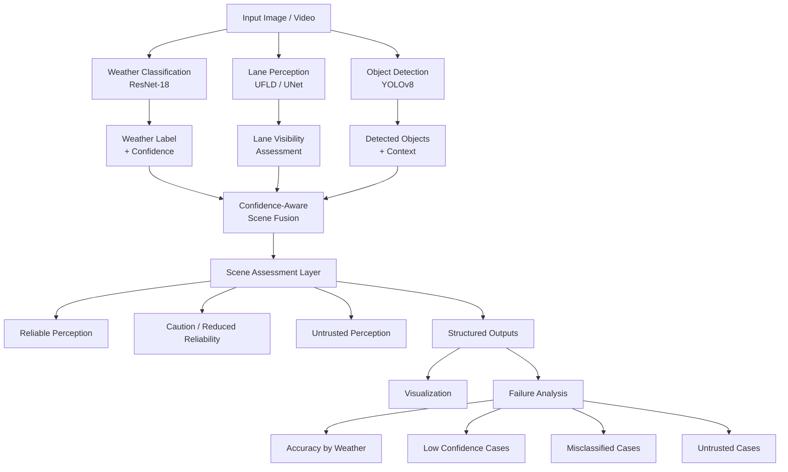

# Weather-Aware Lane Perception and Scene Analysis 

An end-to-end computer vision pipeline for analyzing road scenes under varying weather conditions.

The system combines **weather classification, lane perception, lane visibility assessment, object detection, confidence-aware scene analysis, and automated failure analysis**.

The main objective is to study how environmental conditions such as **clear, rainy, and snowy weather** affect visual perception reliability.

This project is focused on **perception and analysis**, not autonomous vehicle control. It does not generate steering, braking, acceleration, or other vehicle-control commands.

---

## Overview

Visual perception can become unreliable when road conditions change.

Rain can create reflections and reduce contrast. Snow can obscure lane markings and objects. Poor visibility can also reduce the confidence of machine-learning predictions.

This project provides a modular pipeline for analyzing these effects.

Given an image or video, the system:

1. Classifies the weather condition.
2. Estimates weather prediction confidence.
3. Detects and analyzes lane information.
4. Estimates lane visibility.
5. Detects surrounding objects.
6. Combines the perception results into a scene assessment.
7. Identifies potentially unreliable perception results.
8. Generates structured outputs for evaluation and failure analysis.

The complete pipeline runs **offline** and is designed for experimentation, academic evaluation, visualization, and robustness analysis.

---

# Key Capabilities

-  Weather classification using **ResNet-18**
-  Lane perception using **UFLD / UNet**
-  Object detection using **YOLOv8**
-  Weather confidence estimation
-  Lane visibility assessment
-  Confidence-aware scene assessment
-  Automated failure analysis
-  Reliability analysis across weather conditions
-  Annotated demo video generation
-  Structured CSV outputs
-  Fully offline execution

---

# System Architecture

The system follows a modular **perception → fusion → scene assessment → analysis** architecture.



### Pipeline Flow

```text
                 Input Image / Video
                         │
          ┌──────────────┼──────────────┐
          ▼              ▼              ▼
      Weather          Lane          Objects
    Classification    Perception     Detection
          │              │              │
          ▼              ▼              ▼
      Weather +       Lane           Detected
      Confidence     Visibility      Objects
          │              │              │
          └──────────────┼──────────────┘
                         ▼
              Confidence-Aware Fusion
                         │
                         ▼
                Scene Assessment
                         │
             ┌───────────┼───────────┐
             ▼           ▼           ▼
          Reliable     Caution     Untrusted
          Perception   / Reduced   Perception
                       Reliability
             │           │           │
             └───────────┼───────────┘
                         ▼
                Structured Outputs
                         │
              ┌──────────┴──────────┐
              ▼                     ▼
        Visualization         Failure Analysis
```

> **Important:** The scene assessment layer does not control a vehicle. It only evaluates perception reliability and provides an interpretable assessment of the observed road scene.

---

# Models Used

| Component | Model | Purpose |
|---|---|---|
| Weather Classification | ResNet-18 | Classify clear, rainy, and snowy conditions |
| Lane Detection | UFLD | Detect lane structure |
| Lane Segmentation | UNet | Estimate lane-region visibility |
| Object Detection | YOLOv8 | Detect surrounding objects |
| Scene Assessment | Rule-Based Logic | Combine perception information and assess reliability |

---

# Perception Components

## 1. Weather Classification

A fine-tuned **ResNet-18** model is used to classify the weather condition in the input scene.

Supported conditions:

- Clear
- Rainy
- Snowy

The model also produces a confidence value.

For example:

```text
Weather: Clear
Confidence: 0.96
```

or:

```text
Weather: Snowy
Confidence: 0.48
```

The confidence value is used to identify predictions that may be unreliable.

---

## 2. Lane Perception

Lane information is obtained using **UFLD and UNet-based processing**.

The lane component is used to estimate:

- Lane structure
- Lane visibility
- Quality of visible lane information

This becomes particularly important under adverse weather conditions where lane markings may become difficult to detect.

Example:

```text
Lane Visibility: Good
```

or:

```text
Lane Visibility: Poor
```

---

## 3. Object Detection

The system uses **YOLOv8** for object detection.

Detected objects provide additional contextual information about the road scene.

For example:

```text
Detected Objects:
- Car
- Truck
- Person
- Motorcycle
```

Object detection is an **auxiliary perception component**.

It provides contextual information to the fusion stage but does not directly control or determine vehicle behavior.

---

# Confidence-Aware Scene Assessment

The project uses an explicit rule-based assessment layer to interpret the reliability of the perception results.

The purpose is not to make driving decisions.

Instead, it answers questions such as:

- Is the weather prediction reliable?
- Are the lanes clearly visible?
- Is the scene affected by adverse weather?
- Should the current perception result be considered reliable?
- Should the scene be flagged for further attention?

---

## Assessment Logic

A simplified representation is:

```text
IF weather confidence is low
    → UNTRUSTED PERCEPTION

ELSE IF lane visibility is poor
    → REDUCED RELIABILITY / CAUTION

ELSE IF weather is rainy or snowy
    → CONSERVATIVE ASSESSMENT

ELSE
    → RELIABLE PERCEPTION
```

The exact rules are implemented in the project's analysis and decision-logic modules.

---

# Assessment Outputs

Each processed sample can contain information such as:

```text
Weather
Weather Confidence
Lane Visibility
Detected Objects
Assessment Status
Trust Flag
Reason Code
```

Example:

```text
Weather: Rainy
Weather Confidence: 0.91
Lane Visibility: Poor

Assessment: CAUTION
Trust: True
Reason: POOR_LANE_VISIBILITY
```

Another example:

```text
Weather: Snowy
Weather Confidence: 0.42
Lane Visibility: Poor

Assessment: UNTRUSTED
Trust: False
Reason: LOW_WEATHER_CONFIDENCE
```

These outputs describe **perception reliability**, not vehicle-control commands.

---

# Why Confidence Matters

A model prediction should not automatically be treated as correct simply because the model produced it.

For example:

```text
Prediction A
Weather: Rainy
Confidence: 0.97
```

is fundamentally different from:

```text
Prediction B
Weather: Rainy
Confidence: 0.51
```

The second prediction should be treated with more caution.

This project therefore incorporates confidence into the downstream scene assessment instead of relying only on predicted labels.

---

# Failure Analysis

A major component of the project is automated analysis of perception failures.

After running the pipeline, the system can analyze:

- Weather classification accuracy
- Low-confidence predictions
- Misclassified samples
- Untrusted perception results
- Performance differences between weather conditions

This allows the system to answer not only:

> "What did the model predict?"

but also:

> "When does the system become unreliable?"

---

# Project Structure

```text
Project/
│
├── analysis/
│   ├── decision_debug/
│   ├── failure_reports/
│   ├── decision_engine.py
│   ├── decision_logic.py
│   ├── decision_visualize.py
│   └── failure_analysis.py
│
├── code/
│   ├── classifier/
│   │   └── Weather classification
│   │
│   ├── detector/
│   │   └── Object detection
│   │
│   ├── pipeline/
│   │   └── Perception pipeline
│   │
│   ├── unet/
│   │   └── Lane segmentation
│   │
│   ├── yolo/
│   │   └── YOLO utilities
│   │
│   └── utils/
│       └── Shared utilities
│
├── models/
│   ├── weather/
│   ├── unet/
│   └── yolo/
│
├── datasets/
│   └── Demo videos
│
├── results/
│   └── showcase/
│
├── tools/
│   └── Utility scripts
│
├── requirements.txt
├── README.md
└── .gitignore
```

> Model weights are excluded from version control where appropriate.

---

# Installation

## 1. Clone the Repository

```bash
git clone <repository-url>
cd <repository-folder>
```

## 2. Create a Virtual Environment

```bash
python -m venv venv
```

## 3. Activate the Environment

### Windows

```bash
venv\Scripts\activate
```

### Linux / macOS

```bash
source venv/bin/activate
```

## 4. Install Dependencies

```bash
pip install torch torchvision opencv-python numpy pandas ultralytics addict
```

---

# Running the Pipeline

Run the visualization and perception pipeline:

```bash
python -m analysis.decision_visualize
```

The pipeline generates debugging information such as:

- Weather prediction
- Weather confidence
- Lane visibility
- Detected objects
- Assessment status
- Trust flag
- Reason code

The generated summary is stored at:

```text
analysis/
└── decision_debug/
    └── summary.csv
```

---

# Running Failure Analysis

After generating the pipeline outputs, run:

```bash
python -m analysis.failure_analysis
```

This generates:

```text
analysis/
└── failure_reports/
    ├── accuracy_by_weather.csv
    ├── low_confidence.csv
    ├── misclassified.csv
    └── untrusted_decisions.csv
```

---

# Outputs

## Primary Outputs

The pipeline produces:

- Weather label
- Weather confidence
- Lane visibility assessment
- Detected objects
- Perception reliability status
- Trust flag
- Reason code
- Annotated demo video

## Analysis Outputs

| Output | Purpose |
|---|---|
| `accuracy_by_weather.csv` | Compare weather classification performance |
| `low_confidence.csv` | Identify uncertain predictions |
| `misclassified.csv` | Identify incorrect predictions |
| `untrusted_decisions.csv` | Identify perception results that should not be trusted |

---

# Reliability Across Weather Conditions

The current qualitative behavior is:

| Weather | Expected Reliability |
|---|---|
| Clear | High |
| Rainy | Moderate |
| Snowy | Lower |

The reduction in reliability under snow and rain is expected because adverse weather can introduce:

- Reduced contrast
- Reflections
- Occlusions
- Distorted visual features
- Obscured lane markings
- Reduced visibility

The project therefore focuses not only on prediction accuracy but also on **recognizing when perception becomes less reliable**.

---

# Design Principles

## Modular Architecture

Each perception component is separated into its own module.

```text
Weather Classification
        │
Lane Perception
        │
Object Detection
        │
        ▼
Confidence-Aware Fusion
        │
        ▼
Scene Assessment
        │
        ▼
Analysis
```

## Explicit Confidence Handling

The system explicitly considers prediction confidence instead of assuming every model output is equally reliable.

## Interpretability

Assessment results include reason codes and trust information so that the output can be inspected.

## Separation of Inference and Analysis

The perception pipeline generates results, while separate analysis modules evaluate those results.

## Reproducibility

Outputs are stored in structured formats such as CSV files, making experiments easier to inspect and compare.

---

# Limitations

This project is a **computer vision research and academic prototype**, not a production autonomous-driving system.

Current limitations include:

- Offline execution
- Limited weather categories
- Dependence on visual input quality
- Reduced perception reliability under severe weather
- Rule-based scene assessment
- No vehicle-control interface
- No steering or braking control
- No sensor fusion with LiDAR, radar, or GPS
- No real-world safety validation
- No guarantee of autonomous-driving safety

The system should therefore be interpreted as a **road-scene perception and reliability-analysis pipeline**.

---

# Scope

The project focuses on the following research question:

> **How does changing weather affect visual perception reliability, and how can confidence information be used to identify unreliable road-scene perception?**

The project is therefore centered on:

```text
Environmental Conditions
          ↓
Visual Perception
          ↓
Confidence / Visibility
          ↓
Scene Assessment
          ↓
Failure Analysis
```

It does not attempt to replace a complete autonomous-driving stack.

---

# Future Improvements

Potential extensions include:

- Additional weather conditions such as fog and heavy rain
- Temporal analysis across video frames
- Improved lane-confidence estimation
- Better uncertainty estimation
- Multi-frame perception fusion
- Quantitative robustness benchmarking
- Domain adaptation for unseen weather conditions
- Real-time inference optimization
- Integration with simulated driving environments
- Comparison of different perception architectures

---

# Project Status

| Component | Status |
|---|---|
| Weather Classification | ✅ Integrated |
| Lane Perception | ✅ Integrated |
| Lane Segmentation | ✅ Integrated |
| Object Detection | ✅ Integrated |
| Confidence Estimation | ✅ Integrated |
| Scene Assessment | ✅ Implemented |
| Visualization | ✅ Implemented |
| Failure Analysis | ✅ Automated |
| Demo Outputs | ✅ Generated |
| Academic Evaluation | 🔄 Ready |

---

# Important Notes

- Training scripts and experimental training code are intentionally excluded.
- Model weights may be excluded from Git due to file-size considerations.
- The project focuses on **system integration and perception analysis**, rather than dataset-specific optimization.
- Demo outputs are intended for academic evaluation and visualization.
- The system does **not** control a vehicle.
- Assessment outputs should not be interpreted as real-world driving commands.

---

# Author

**Utkarsh**

**Weather-Aware Lane Perception and Scene Analysis Pipeline**

---

## Summary

This project provides an end-to-end framework for analyzing road scenes under changing weather conditions.

The core pipeline is:

```text
        INPUT
          │
          ▼
 ┌────────────────────────┐
 │ Weather Classification │
 └────────────────────────┘
          │
 ┌────────┼────────┐
 ▼        ▼        ▼
Weather   Lane    Objects
Confidence Perception Detection
 │        │        │
 └────────┼────────┘
          ▼
 Confidence-Aware
      Fusion
          │
          ▼
  Scene Assessment
          │
          ▼
 Reliability Analysis
          │
          ▼
 Failure Reports
```

The key idea is simple:

> **The system does not try to drive the vehicle. It tries to understand the road scene and determine how reliable that perception is under different weather conditions.**
